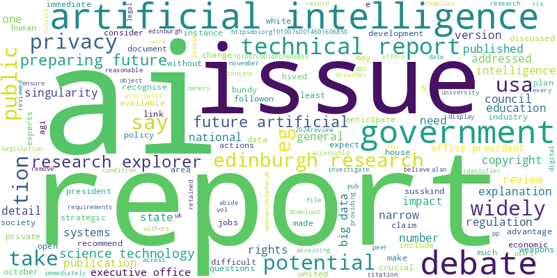

# pdf-worldcloud-project
Text mining and visualization using Python (PDF TO WORDCLOUD)
# PDF WordCloud Project

This project extracts text from a PDF, cleans it using Python (removing stopwords and punctuation), and generates a WordCloud visualization.  

## Features
- Extracts text from PDF using `pdfplumber`
- Cleans text with `nltk` stopwords
- Creates a WordCloud using `wordcloud` and `matplotlib`
- Saves both the cleaned text and the WordCloud image

## Technologies Used
- Python
- pdfplumber
- nltk
- wordcloud
- matplotlib

## How to Run
1. Place your PDF file in the project folder.
2. Update the `file_path` in the code to match your PDF file name.
3. Run the Python script in Google Colab or Jupyter Notebook.
4. The project will generate:
   - `cleaned_text.txt`
   - `wordcloud.png`

## Example Output

